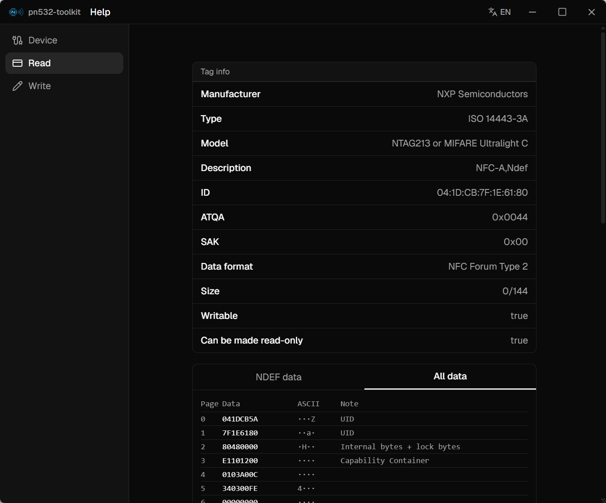

# pnfc-toolkit

跨平台 NFC 标签读写/查看工具，用 Tauri 2 + React + Rust 构建。

目前是围绕 **PN532** 模块、通过串口（UART）连接实现的——未来可能会加入对其它 NFC 控制器芯片（比如 PN7160）的支持。

[English](README.md)



## 平台支持情况

| 平台 | 状态 |
| --- | --- |
| Windows | 开发和实测都在真实硬件上完成 |
| Linux | 代码已实现，**目前还没有在真实硬件上测试过** |
| macOS | 代码已实现，**目前还没有在真实硬件上测试过** |

Linux/macOS 平台专属的那部分代码（比如串口友好名称查询）是照着公开文档写的，能做单元测试的部分也都测过了，但整个应用目前还没有在这两个平台上接过真实的 PN532 硬件跑通。如果你在 Linux 或 macOS 上试过，无论是遇到问题还是一切正常，都欢迎反馈。

## 功能

- [x] **连接** —— 自动扫描并连接通过 USB 转串口接的 PN532，显示芯片型号/固件版本、VID:PID、制造商等设备信息
- [x] **读取 UID / ATQA / SAK / 卡片类型** —— 支持 MIFARE Classic（1K/4K/Mini）和 MIFARE Ultralight/NTAG21x，通过 `GET_VERSION` 精确识别具体型号
- [x] **完整内存 dump**（Ultralight/NTAG）—— 原始页面数据，加上 NDEF 消息解析（URI、纯文本、vCard、WiFi 记录）
- [x] **MIFARE Classic 扇区访问** —— 逐扇区认证（内置默认密钥字典），以及区块数据查看
- [x] **MIFARE Classic 卡片复制/克隆** —— 包括在可写 UID 的"magic"/CUID 卡上克隆 UID
- [x] **写入 NDEF 记录** —— URL、纯文本、电话、短信、邮箱、地理位置、vCard 名片、WiFi 配置（WPS），多条记录会打包进同一条 NDEF 消息
- [x] **NTAG/Ultralight 写密码保护** —— 设置、修改、取消
- [x] **中英文界面** —— 标题栏随时可切换，选择会被记住
- [x] **调试面板** —— 实时日志、原始协议帧查看器（可以隐藏后台轮询卡片产生的重复"心跳"帧）、串口探测工具，以及一个原始 `InDataExchange` 发送器，方便手动试探卡片支持哪些指令
- [ ] **把空白标签格式化成 NDEF 格式** —— 现在写入要求标签本身已经有 Capability Container
- [ ] **真正的硬件只读锁定**（OTP 锁位）—— 现在的"密码保护"只保护写入，而且是可逆的
- [ ] **独立的"原始指令"页面** —— 目前给卡片发任意指令只能通过调试面板，还不是一个正式的功能页面
- [ ] **MIFARE Classic 4K/Mini 真机验证** —— 扇区布局是照公开文档实现的，还没有在真实的 4K/Mini 硬件上测试过

## 硬件要求

任何接成 **UART/USB 转串口模式**（不是 I2C 或 SPI）、波特率 115200 的 PN532 模块都应该能用，包括常见的 CH340 转串口板子。

## 快速开始

前置依赖：[Rust](https://www.rust-lang.org/tools/install)、[Node.js](https://nodejs.org/)、[pnpm](https://pnpm.io/)，以及对应操作系统的 [Tauri 前置依赖](https://tauri.app/start/prerequisites/)。

```bash
pnpm install

# 开发模式运行
pnpm tauri dev

# 构建发布版本
pnpm tauri build
```

## 技术栈

- [Tauri 2](https://tauri.app/) + Rust：原生外壳、PN532/串口通信
- React 19 + TypeScript + Tailwind CSS：界面
- [`serialport`](https://crates.io/crates/serialport)：跨平台串口 I/O

## 项目结构

```
src/                 React 前端
  components/        页面和 UI 组件
  hooks/              连接状态、轮询
  lib/                国际化、NDEF/vCard 辅助函数、共享类型
src-tauri/src/
  pn532/
    protocol.rs       PN532 UART 底层帧协议（ACK、校验和、帧解析）
    session.rs        连接生命周期 + 卡片操作（读/写/认证/复制）
    ndef.rs            NDEF 消息构造/解析
    probe.rs            串口扫描/探测
    friendly_name.rs   各平台的串口友好名称查询（Windows/Linux/macOS）
  lib.rs              Tauri 命令处理函数
```
